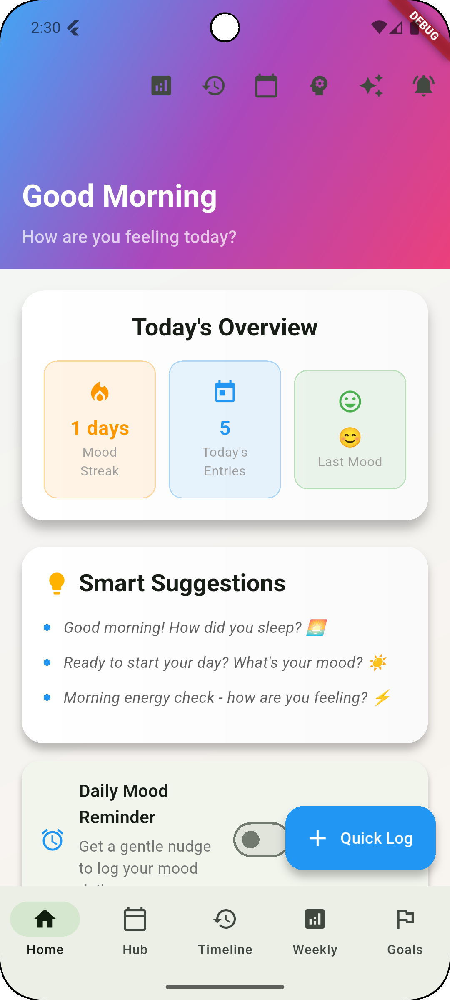
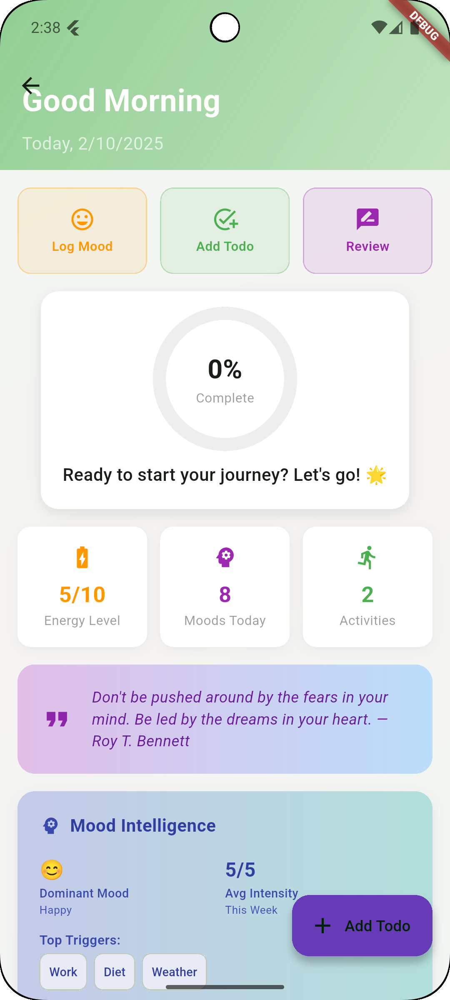
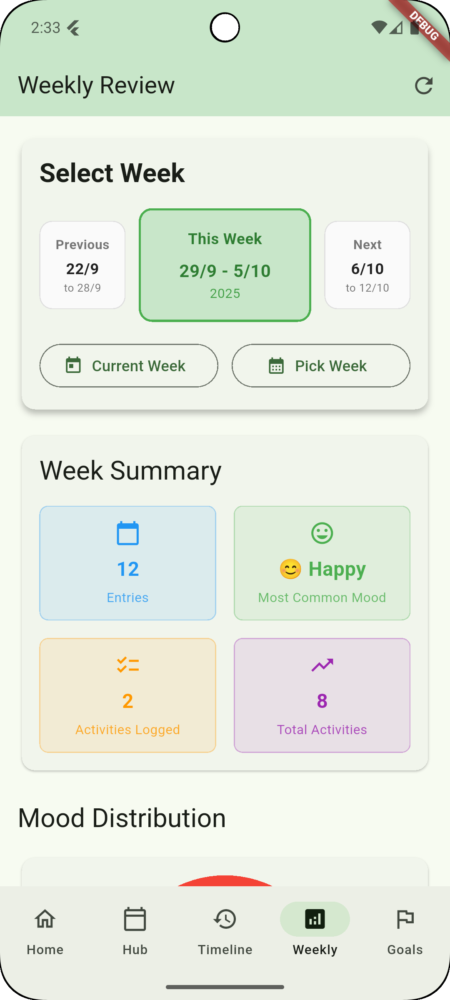

<div align="center">
  <h1>Bloom App</h1>
  <p><em>Your daily companion for emotional growth, habits, and meaningful progress.</em></p>

  <!-- Badges (optional) -->
  <p>
    
    
    
  </p>

  <!-- Hero screenshots (add your images to docs/screenshots and update paths) -->
  <p>
    
    
    
    
  </p>
</div>

---

## Overview
Bloom is a modern Flutter app for mood tracking, activity logging, habit formation, and weekly reflection. It blends a delightful user experience with practical habit science and actionable insights, backed by MongoDB Atlas for reliable cloud persistence.

## Key Features
- Mood logging with intensity, activities, triggers, and notes
- Dynamic mood theming and celebratory streaks
- Smart suggestions and greetings based on context
- Daily Hub: Today’s overview, focus/todos, evening review, insights
- Habit Tracker with completions, streaks, stats, and suggestions
- Weekly Review with improved week navigation and charts
- Timeline redesigned as a grouped, vertical timeline with filters
- Local notifications with a daily reminder toggle and time picker
- MongoDB Atlas persistence via `mongo_dart`

## Screens
- Home: gradient UI, smart dashboard, quick mood, detailed form, quick-log FAB
- Daily Hub: intelligent overview, progress ring, stats, todos, evening review
- Timeline: grouped-by-day vertical timeline with mood filters and details
- Weekly Review: week selector, summaries, and charts
- Habit Tracker: add/complete habits, difficulty suggestions, stats

Add screenshots under `docs/screenshots/` and update image paths above. Suggested files:
- `home.png`, `daily_hub.png`, `timeline.png`, `weekly_review.png`, `habit_tracker.png`

## Architecture
- UI: Flutter widgets with animations (`AnimationController`, transitions, haptics)
- State: local `setState` with structured services for data
- Data: Repository-style `StorageService` delegating to Mongo services
- DB: MongoDB Atlas via `mongo_dart`, collections for moods, todos, reviews, habits, goals
- Notifications: `flutter_local_notifications` with timezone scheduling

## Tech Stack
- Flutter 3.x
- mongo_dart
- flutter_local_notifications
- permission_handler
- fl_chart

## Getting Started

### Prerequisites
- Flutter SDK installed (run `flutter doctor`)
- Android SDK / emulator
- MongoDB Atlas cluster and connection string

### Setup
1) Install dependencies
```bash
flutter pub get
```

2) Configure MongoDB
- Create a MongoDB Atlas cluster
- Whitelist your IP or set “Access from Anywhere”
- Create database user and password
- Update your connection string in `lib/services/mongodb_service.dart` (database `bloom_app` recommended)

3) Android permissions
- Notifications are requested at runtime; for Android 13+, the app asks permission on init
- If you schedule daily reminders, the app uses inexact alarms to avoid exact-alarm permission

### Run
```bash
flutter run
```

## Notifications
- Ad-hoc test from Home AppBar bell icon
- Daily reminder: enable toggle and choose time on Home
- Implementation: `NotificationService` with timezone support and safe inexact scheduling

## Project Structure (high level)
```
lib/
  models/
    mood_entry.dart
    todo.dart
    habit.dart
    daily_review.dart
    goal.dart
  services/
    mongodb_service.dart
    storage_service.dart
    notification_service.dart
    ... (todo / review / habit / goal services)
  screens/
    home_page.dart
    daily_hub_page.dart
    timeline_page.dart
    weekly_review_page.dart
    habit_tracker_page.dart
    ai_insights_page.dart
  widgets/
    mood_button.dart
    activity_button.dart
docs/
  screenshots/ (add your images here)
```

## Development Notes
- Animations tuned for responsiveness; use pull-to-refresh on major lists
- Timeline supports compact/expanded view and mood filters
- Quick Log uses a local `StatefulBuilder` for instant tapping
- Daily reminder uses inexact alarms to avoid exact-alarm permission issues

## Roadmap
- Optional: sticky headers for Timeline
- Search and advanced filters (by activity/trigger/date)
- Export data (CSV/JSON)
- iOS build and notification tuning

## Contributing
Issues and PRs are welcome. Please keep changes focused and documented.

## License
MIT

---

### Showcase Tips
- Capture screenshots from an emulator or device and place them in `docs/screenshots/`
- Use consistent device sizes and light theme for visual consistency
- Update the hero images at the top of this README with your best screens

# 🌱 Bloom - Emotional & Activity Growth Tracker

A Flutter app that helps you track your daily emotions and activities to understand patterns and grow into your best self.

## Features

- **Daily Mood Logging**: Select from 5 mood options (Happy, Sad, Angry, Calm, Tired)
- **Activity Tracking**: Log 2-5 key activities per day
- **Timeline View**: See all your entries in chronological order
- **Cloud Storage**: Data stored in MongoDB Atlas for persistence
- **Interactive UI**: Tap entries for details, swipe to delete

## Tech Stack

- **Frontend**: Flutter (Dart)
- **Database**: MongoDB Atlas
- **State Management**: Flutter StatefulWidget

## Getting Started

### Prerequisites

- Flutter SDK (3.9.2 or higher)
- Android Studio / VS Code
- MongoDB Atlas account

### Installation

1. Clone the repository:
```bash
git clone https://github.com/yourusername/bloom_app.git
cd bloom_app
```

2. Install dependencies:
```bash
flutter pub get
```

3. Set up MongoDB Atlas:
   - Create a MongoDB Atlas account
   - Create a new database called `bloom_app`
   - Create a collection called `mood_entries`
   - Get your connection string

4. Update the connection string in `lib/services/mongodb_service.dart`

5. Run the app:
```bash
flutter run
```

## Project Structure

```
lib/
├── main.dart                 # App entry point
├── models/
│   └── mood_entry.dart      # Data model for mood entries
├── screens/
│   ├── home_page.dart       # Main mood logging screen
│   └── timeline_page.dart   # Timeline view of all entries
├── services/
│   ├── storage_service.dart # Storage abstraction layer
│   └── mongodb_service.dart # MongoDB Atlas integration
└── widgets/
    └── mood_button.dart     # Reusable mood selection button
```

## Usage

1. **Log Your Mood**: Select how you're feeling today
2. **Add Activities**: Choose what you did today
3. **Save Entry**: Tap save to store your data
4. **View Timeline**: See all your past entries
5. **Manage Entries**: Tap for details, swipe to delete

## Future Features

- Weekly review charts
- Mood insights and patterns
- Voice logging
- AI-powered suggestions
- Wearable integration

## Contributing

This is a personal project, but feel free to fork and modify for your own use!

## License

MIT License - feel free to use this code for your own projects.
